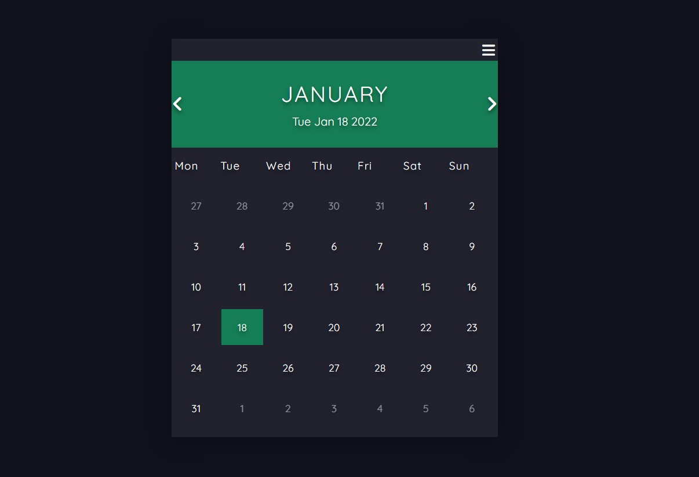

# Calendar (Google Style)
A simple calendar web app using HTML, CSS and JS taken from **Code and Create**'s tutorial, very easy to understand and follow. For now the only change I have done is my calendar week starts from *Monday* instead of Sunday.

  
 

 

  <em>Sample screenshot</em>
 

## ToDo
- [ ] Go-to-date functionality - roll style date selection for year, month and date
- [ ] Settings menu
  - [ ] Theme selector
  - [ ] First day of week setting

## References
Here's the video tutorial [Youtube Link](https://www.youtube.com/watch?v=o1yMqPyYeAo) for those interested.

### Fonts
- [Google font](https://fonts.google.com/specimen/Quicksand?query=quick)
- [Font awesome](https://cdnjs.com/libraries/font-awesome)

